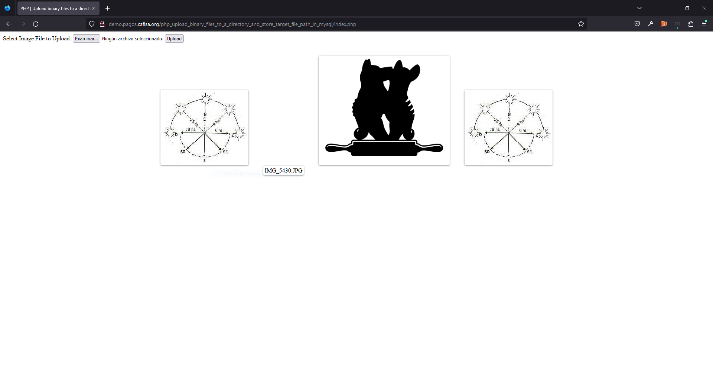

# PHP | Upload binary files to a directory and store target file path in MySQL

This repository is an example of upload and store image file in database and server using PHP and MySQL.

- HTML form to upload image
- Upload image to server using [move_uploaded_file()](https://www.php.net/manual/en/function.move-uploaded-file.php) function in PHP
- Store file path in the database using PHP and MySQL
- Retrieve images from the database and display in the web page

 

Deployed by **[jlammx](https://github.com/jlammx)**
- 🚀 Live: [View deployment](http://demo.pagos.cafisa.org/php_upload_binary_files_to_a_directory_and_store_target_file_path_in_mysql)

 

There are various ways available to [upload image to server](https://github.com/jlammx/php_upload_binary_files_to_a_directory) and display images on the webpage. Generally, in a dynamic web application, the uploaded image is stored in a directory of the server and the file name is inserted in the database. Later, the images are retrieved from the server based on the file name stored in the database and display on the web page.

The image can be [uploaded directly to the database](https://github.com/jlammx/php_upload_blob_files_in_mysql) without storing on the server. But it will **increase the database size and web page load time**. So, it’s always a good idea to upload images to the server and store file names in the database.

### Steps

1. [Create database and table](/assets/database/dev_test_tbl_image.sql)
2. [Connect database](/include/db_connection.php)
3. [Create HTML form](/index.php)
4. [Upload file to server and store in database](/upload.php)
5. [Display images from database](/viewImages.php)

### Screenshots

	
	
    
    

> 🔴 Live 

	</img>

### Skills

	 
    

 

	

		 
		
		&nbsp;&nbsp;&nbsp;&nbsp;
	

 Last updated at 15 Mar 2023

